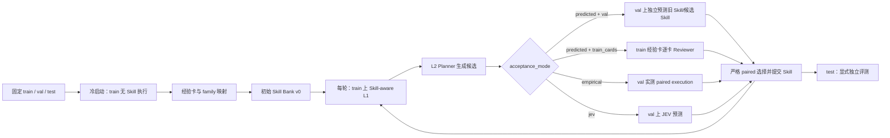

# SkillExpand

SkillExpand 从任务执行轨迹中提取经验卡，归纳初始 Skill，再通过 L2 演化 Skill。它维护自然语言 Skill 版本，不训练模型权重；当前支持 SearchQA 和 ALFWorld。

## 当前闭环

实验开始前固定互斥的 `train`、`val`、`test` 三个 split，默认比例为 50/25/25。



`train` 是唯一可产生经验卡并驱动 Skill 编辑的 split。`val` 可以在接受候选时重复使用，因此会被选择过程污染；`test` 只用于独立报告，绝不回流到 L2。`--phase all` 只运行冷启动和指定轮数的 Evolve，不自动执行 test 评测。

冷启动对每个 train task 进行无 Skill L1，保存每次尝试、动作、环境反馈、反思和最终经验卡。随后程序提取能力标签、生成 family 提案，并让每个 train task 选择唯一 family。跨卡 pattern 只是有证据引用的候选归纳，初始 Skill 的 description 和 body 仍需经过程序校验后才冻结。

每轮 Evolve 先用当前 Skill 在同一组 train task 上重新执行 Skill-aware L1，生成该轮独立经验卡；L2 只读取本轮卡、当前 Skill 和该批 pattern。每个 Skill 的 train 卡按固定顺序分批，Planner 提出不同修改假设，structured 模式下直接输出一个受 schema 约束的 edit，rewrite 模式下生成候选 body。description 始终冻结。

## Predicted reviewer

`predicted` 有两条可切换路径，默认是 `val`：

- `val`：使用配置的 `l2_reviewer` 模型，逐 task 预测一次自主尝试成功概率。模型只看到 task 和 Skill，不读取经验卡、轨迹或答案。旧 Skill 和每个候选 Skill 使用同一冻结 val route，只有候选平均预测成功率严格更高才接受。
- `train_cards`：兼容原有流程。Reviewer 每次读取一张 train 经验卡、当前 Skill 和匿名候选，输出 paired 的 old/new outcome；程序推导 improve/regress/unchanged/unknown。

运行时可通过以下参数切换：

```bash
--acceptance-mode predicted --predicted-review-scope val
--acceptance-mode predicted --predicted-review-scope train_cards
```

`empirical` 和 `jev` 也都使用冻结的 val route，但分别执行真实环境测量或调用 JEV 服务。所有 acceptance 结果、panel、task IDs、请求数和 protocol hash 都写入批次工件；`val` predicted 路径的 benchmark `executions` 固定为 0。

## 运行示例

显式 split 文件必须使用最新命名：

```json
{"assignment":{"0":"train","1":"train","2":"val","3":"test"}}
```

冷启动：

```bash
.venv/bin/python -m skillexpand \
  --benchmark searchqa --task-file /absolute/path/tasks.json \
  --split-file /absolute/path/splits.json \
  --run-dir runs/searchqa-example --phase cold-start \
  --cold-start-workers 8 --family-discovery-workers 8
```

两轮 Evolve，默认使用 val predicted reviewer：

```bash
.venv/bin/python -m skillexpand \
  --benchmark searchqa --run-dir runs/searchqa-example \
  --phase evolve --evolve-rounds 2 --resume \
  --acceptance-mode predicted --predicted-review-scope val
```

独立 test 评测：

```bash
.venv/bin/python -m skillexpand \
  --benchmark searchqa --run-dir runs/searchqa-example \
  --phase test --resume
```

`test` 是独立评测阶段和数据 split，产物位于 `test/<library-hash>/`。

## 工件与审计

运行目录保存 `discovery/`、`evolution/round-N/`、`l2_proposals/`、`l2_batches/`、`skills.jsonl`、`routes/val/`、`routes/test/` 和 `test/<library-hash>/`。`l2_manifest.json` 冻结 split、配置、代码和模型身份；每轮 audit 会校验 train 覆盖、卡片 hash、候选重放、Skill 版本链及 acceptance scope。

改变 prompt、代码、模型、split 或并发协议必须使用新的运行目录。恢复只复用当前协议已落盘的逐单元结果。

安装和 benchmark 环境配置见 [运行指南](docs/RUNNING.md) 与 [Benchmark/L1 接口](docs/BENCHMARKS.md)；系统设计见 [架构](docs/ARCHITECTURE.md)，L2 审计见 [L2 审计](docs/L2_CARD_REVIEW_AUDIT.md)。

最近一次 SearchQA/ALFWorld campaign 的审计状态和历史 test 快照见
[实验状态记录](docs/EXPERIMENT_STATUS_20260930.md)。
