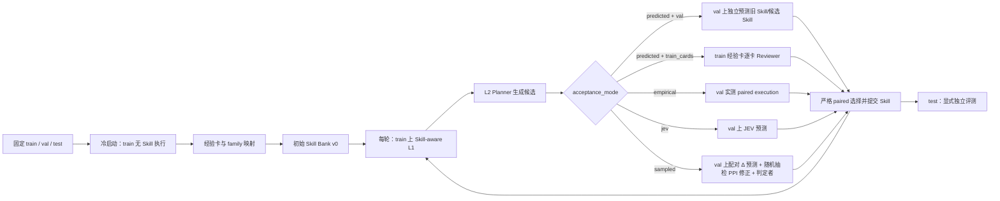

# SkillExpand

SkillExpand 从任务执行轨迹中提取经验卡，归纳初始 Skill，再通过 L2 演化 Skill。它维护自然语言 Skill 版本，不训练模型权重；当前支持 SearchQA 和 ALFWorld。

## 当前闭环

实验开始前固定互斥的 `train`、`val`、`test` 三个 split，默认比例为 50/25/25。



`train` 是唯一可产生经验卡并驱动 Skill 编辑的 split。`val` 可以在接受候选时重复使用，因此会被选择过程污染；`test` 只用于独立报告，绝不回流到 L2。`--phase all` 只运行冷启动和指定轮数的 Evolve，不自动执行 test 评测。

冷启动对每个 train task 进行无 Skill L1，保存每次尝试、动作、环境反馈、反思和最终经验卡。随后程序提取能力标签、生成 family 提案，并让每个 train task 选择唯一 family。跨卡 pattern 只是有证据引用的候选归纳，初始 Skill 的 description 和 body 仍需经过程序校验后才冻结。

每轮 Evolve 先用当前 Skill 在同一组 train task 上重新执行 Skill-aware L1，生成该轮独立经验卡；L2 只读取本轮卡、当前 Skill 和该批 pattern。每个 Skill 的 train 卡按固定顺序分批，Planner 提出不同修改假设，structured 模式下直接输出一个受 schema 约束的 edit，rewrite 模式下生成候选 body。description 始终冻结。

## Predicted reviewer

`predicted` 有两条可切换路径，默认是 `val`：

- `val`：使用配置的 `l2_reviewer` 模型，逐 task 预测一次自主尝试成功概率。模型只看到 task 和 Skill，不读取经验卡、轨迹或答案。旧 Skill 和每个候选 Skill 使用同一冻结 val route，只有候选平均预测成功率严格更高才接受。
- `train_cards`：兼容原有流程。Reviewer 每次读取一张 train 经验卡、当前 Skill 和匿名候选，输出 paired 的 old/new outcome；程序推导 improve/regress/unchanged/unknown。

运行时可通过以下参数切换：

```bash
--acceptance-mode predicted --predicted-review-scope val
--acceptance-mode predicted --predicted-review-scope train_cards
--acceptance-mode sampled
```

`empirical` 和 `jev` 也都使用冻结的 val route，但分别执行真实环境测量或调用 JEV 服务。所有 acceptance 结果、panel、task IDs、请求数和 protocol hash 都写入批次工件；`val` predicted 路径的 benchmark `executions` 固定为 0。

## Planner–Reviewer 协同进化（`sampled`）

`--acceptance-mode sampled` 是当前的协同进化协议（要求 `--skill-edit-mode structured`）：

- Planner 的每条改动必须附上可核实的**声明**（触发条件 + 动作变化）；
- Reviewer 每题预测**配对增量** Δ，并单独报告该规则是否会触发；
- 真实环境随机抽 `--acceptance-sample-size` 道 val 题执行两臂（该值是上限，panel 更小的 family 全量执行；panel 只有 1 题时无法判定，一律拒绝并记为 `insufficient_sample`；panel 为空时整批 hold），用样本上的成对误差修正 panel 全体预测（PPI）；
- 修正后的单侧置信下界（`--acceptance-confidence`，默认 0.9）大于 0 才接受。判定带 `1e-9` 舍入保护；
- 独立**判定者**读取每道抽检题的两条执行轨迹，判断两者行为是否不同、首个不同在哪一步、差异是否由该规则引起并符合声明（`--claim-verification off` 可关闭，用于消融）；
- 双方各有一份记忆：Planner 拿到改动层聚合（不含任何 val 题目），Reviewer 拿到检索式判断案例（高估、低估、正确）。分别由 `--planner-memory-mode`、`--reviewer-memory-mode` 控制；
- 旧的 train-panel Reviewer 校准在该协议下不启用：`--reviewer-update-mode` 默认且只能为 `none`，显式给其它值会报错。

设计与预注册指标见 [实验计划](docs/EXPERIMENT_PLAN_PLANNER_REVIEWER_COEVOLVE.md)。

## Reviewer 协同演化（旧协议，单候选）

`--acceptance-mode predicted --reviewer-update-mode rules` 是旧协议：每轮结束后在固定 train family panel 上执行旧 head 与候选各一次，把预测与实测写入 `reviewer_feedback.jsonl`，再由 Reviewer 压缩成有限校准规则放入下一轮 prompt。

| 模式 | 行为 |
|---|---|
| `none` | 不收集反馈，Reviewer 始终使用初始 prompt；sampled 下默认且只能为此值 |
| `summary` | 收集反馈并生成 update，但 update 只用于审计 |
| `rules` | 把程序统计 + Reviewer 压缩出的校准规则放入下一轮 predicted-val Reviewer 的 prompt；predicted/empirical/jev 的默认值 |

`--reviewer-feedback-size N` 把每个 family 的反馈 panel 固定为前 N 个 train task（0 表示全部）。该协议已由 sampled 取代，仅作为历史参照保留，见[旧实验计划](docs/EXPERIMENT_PLAN_REVIEWER_COEVOLVE.md)（deprecated）。注意：非 sampled 协议下 `--reviewer-update-mode` 的默认值仍是 `rules`，不显式传 `none` 就会启用该校准（包括每轮在 train panel 上的额外真实执行）。

## 模型角色

七个角色可以使用不同模型：`--l1-model`（执行 agent）、`--cold-start-model`、`--l2-planner-model`、`--l2-editor-model`、`--l2-reviewer-model`、`--l2-verifier-model`（sampled 协议的判定者）、`--selector-model`。未指定的角色沿用导入冷启动中冻结的映射，没有映射时使用配置中的执行模型（`EXPE_LLM_MODEL`）。导入冷启动时先恢复其冻结配置，再应用本次运行显式给出的角色，因此 L2 角色可以与冷启动时的执行模型不同。单因素替换实验的矩阵由 `scripts/model_role_matrix.py` 生成，见 [实验计划](docs/EXPERIMENT_PLAN_MODEL_ROLES.md)。

## 运行示例

显式 split 文件必须使用最新命名：

```json
{"assignment":{"0":"train","1":"train","2":"val","3":"test"}}
```

冷启动：

```bash
.venv/bin/python -m skillexpand \
  --benchmark searchqa --task-file /absolute/path/tasks.json \
  --split-file /absolute/path/splits.json \
  --run-dir runs/searchqa-example --phase cold-start \
  --cold-start-workers 8 --family-discovery-workers 8
```

两轮 Evolve，默认使用 val predicted reviewer：

```bash
.venv/bin/python -m skillexpand \
  --benchmark searchqa --run-dir runs/searchqa-example \
  --phase evolve --evolve-rounds 2 --resume \
  --acceptance-mode predicted --predicted-review-scope val
```

独立 test 评测：

```bash
.venv/bin/python -m skillexpand \
  --benchmark searchqa --run-dir runs/searchqa-example \
  --phase test --resume
```

`test` 是独立评测阶段和数据 split，产物位于 `test/<library-hash>/`。某一轮结束时的 Skill Bank 快照（`--round 0` 为冷启动库）可在同一组冻结 test 路由上评测：

```bash
.venv/bin/python scripts/evaluate_snapshot.py \
  --run-dir runs/searchqa-example --round 1 --output runs/searchqa-example/test-snapshots/round-1
```

## 工件与审计

运行目录保存 `discovery/`、`evolution/round-N/`、`l2_proposals/`、`l2_batches/`、`skills.jsonl`、`routes/val/`、`routes/test/`、`val/`（predicted/sampled 的逐题预测、抽检与判定缓存）和 `test/<library-hash>/`。`l2_manifest.json` 冻结 split、配置、代码和模型身份；每轮 audit 会校验 train 覆盖、卡片 hash、候选重放、Skill 版本链及 acceptance scope。

改变 prompt、模型、split、配置或验收协议必须使用新的运行目录。只改源码时，`--resume` 默认拒绝继续；确认改动不影响协议后可加 `--allow-code-change`，漂移会追加到冻结 manifest 旁的 `code_changes.jsonl`，原 manifest 不改写。恢复只复用当前协议已落盘的逐单元结果。

## 代码与脚本

`src/skillexpand/` 按层组织，只允许向下依赖（`tests/test_layering.py` 强制检查）：`schema`/`structured_skill` → `persistence`（`io.py` 提供原子写、冻结、JSONL 和锁）与 `reliability`（异常分类、重试/修复策略、单元失败记录，见 [异常处理](docs/ERROR_HANDLING.md)）→ `benchmarks` → `runtime`（执行器、LLM、任务池）→ `l1` → `evaluation` → `l2` → `campaign`/`cli`。

`scripts/` 只放可复用入口：`run_campaign.py`（冻结 campaign，逻辑在 `skillexpand.campaign`）、`check_fresh_campaign.py`、`evaluate_snapshot.py`、`model_role_matrix.py`、`summarize_model_role_matrix.py`、`evaluate_jev.py`、`prepare_data.py`、`probe_campaign_capacity.py`、`detach.py` 和环境脚本。代码不兼容旧版本产生的运行目录；旧 run 只能用产生它的代码续跑或审计。

安装和 benchmark 环境配置见 [运行指南](docs/RUNNING.md) 与 [Benchmark/L1 接口](docs/BENCHMARKS.md)；系统设计见 [架构](docs/ARCHITECTURE.md)，L2 审计见 [L2 审计](docs/L2_CARD_REVIEW_AUDIT.md)。

最近一次 SearchQA/ALFWorld campaign 的审计状态和历史 test 快照见
[实验状态记录](docs/EXPERIMENT_STATUS_20260930.md)。
